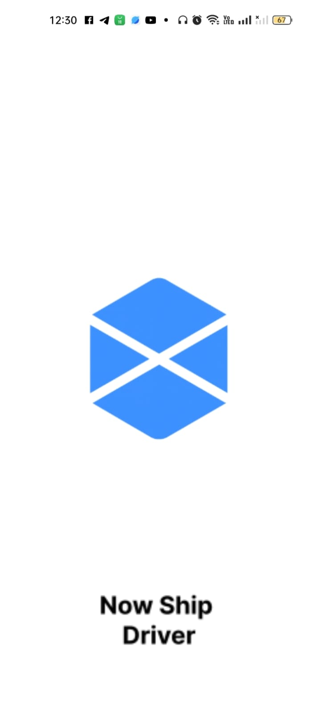
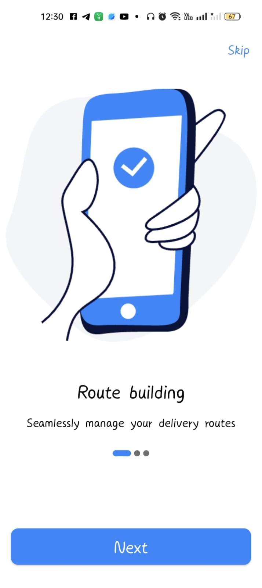
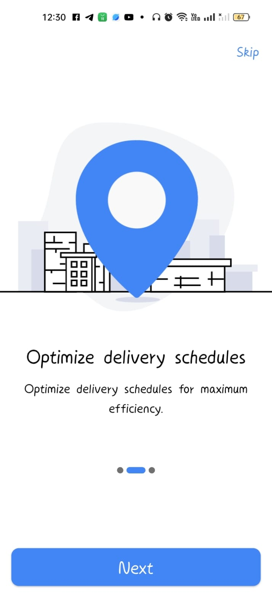
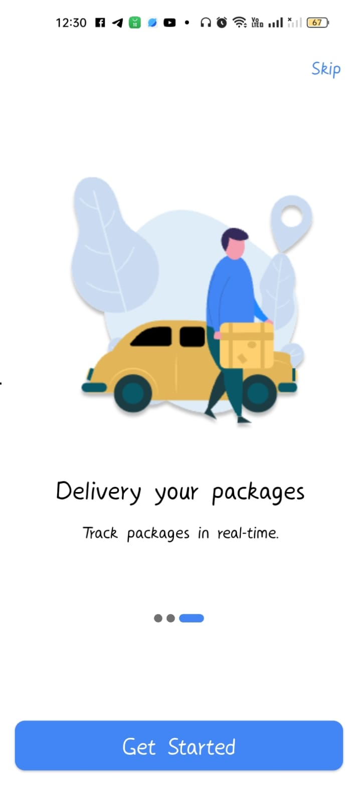

# 🚚 now_ship_driver

✅A new Flutter project  designed for delivery drivers, helping them track orders, receive assignments,
and monitor delivery status in a practical and user-friendly way.

## Getting Started with screenshots of native splash screen and onboarding screens
✨ Native Splash Screen

✨ OnBoarding Screens

  

This project is a starting point for a Flutter application.

A few resources to get you started if this is your first Flutter project:

- [Lab: Write your first Flutter app](https://docs.flutter.dev/get-started/codelab)
- [Cookbook: Useful Flutter samples](https://docs.flutter.dev/cookbook)

For help getting started with Flutter development, view the
[online documentation](https://docs.flutter.dev/), which offers tutorials,
samples, guidance on mobile development, and a full API reference.
